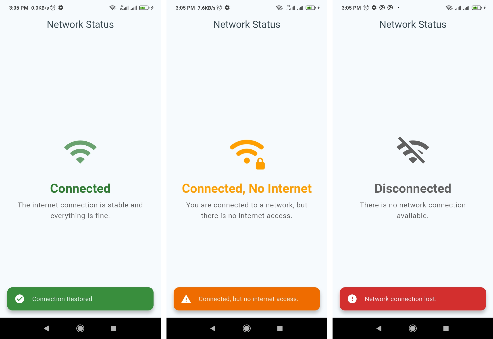
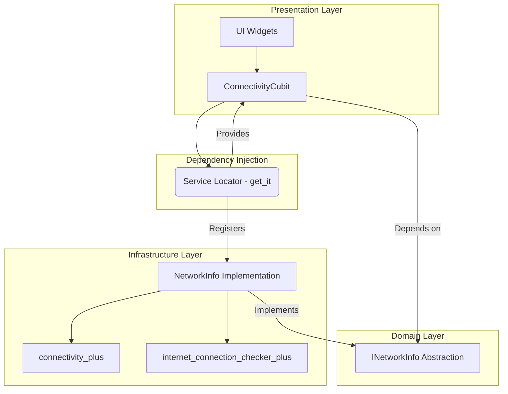

# Network Status Service App

A Flutter application that demonstrates how to build a robust, real-time network connectivity monitoring service. The app displays the current network status and provides instant feedback via snack bars when the connection state changes.



---

## Features

- **Real-time Connectivity Monitoring**: Continuously checks for network interface and internet access.
- **Granular Status Updates**: Differentiates between several network states:
  - `Connected`: Stable internet connection.
  - `No Service`: Connected to a network (e.g., Wi-Fi) but with no internet access.
  - `Disconnected`: No active network interface.
  - `Uninitialized`: Initial state before the first check.
- **Reactive UI**: The user interface instantly updates to reflect the current network status.
- **Instant Feedback**: Displays a styled `SnackBar` notification whenever the connection status changes.
- **Scalable Architecture**: Built using modern practices like BLoC for state management and a service locator for dependency injection.

---

## Architecture Overview

The application follows a clean architecture pattern, separating concerns into distinct layers.

- **Domain**: Contains the core business logic and entities, such as the `NetworkStatus` enum and the `INetworkInfo` abstract contract. This layer is independent of any framework.
- **Infrastructure**: Implements the contracts defined in the domain layer. `NetworkInfo` is the concrete implementation that uses `connectivity_plus` and `internet_connection_checker_plus` to provide network status.
- **Presentation**: The UI layer, which includes widgets and state management.
  - **State Management**: `ConnectivityCubit` (built with `flutter_bloc`) listens to the `NetworkInfo` service and emits states that the UI can react to.
  - **Widgets**: `NetworkStatusView` displays the current status, and `StatusSnackBar` provides notifications.
- **Dependency Injection**: `get_it` is used as a service locator (`sl`) to provide dependencies (like `NetworkInfo`) to the presentation layer, decoupling the layers from each other.



---

## Getting Started

### Prerequisites

- [Flutter SDK](https://docs.flutter.dev/get-started/install) (version 3.9.2 or higher)
- A configured IDE (like [VS Code](https://code.visualstudio.com/) with the Flutter extension or [Android Studio](https://developer.android.com/studio)).

### Installation

1. **Clone the repository:**
   ```sh
   git clone <repository-url>
   cd network_status_service
   ```

2. **Install dependencies:**
   ```sh
   flutter pub get
   ```

---

## Usage

To run the application, use the following command:

```sh
flutter run
```

The app will launch on your connected device or emulator and immediately start monitoring the network status.

---

## Running Tests

This project includes a suite of unit and widget tests to ensure code quality and correctness.

To run all tests, execute the following command:
```sh
flutter test
```